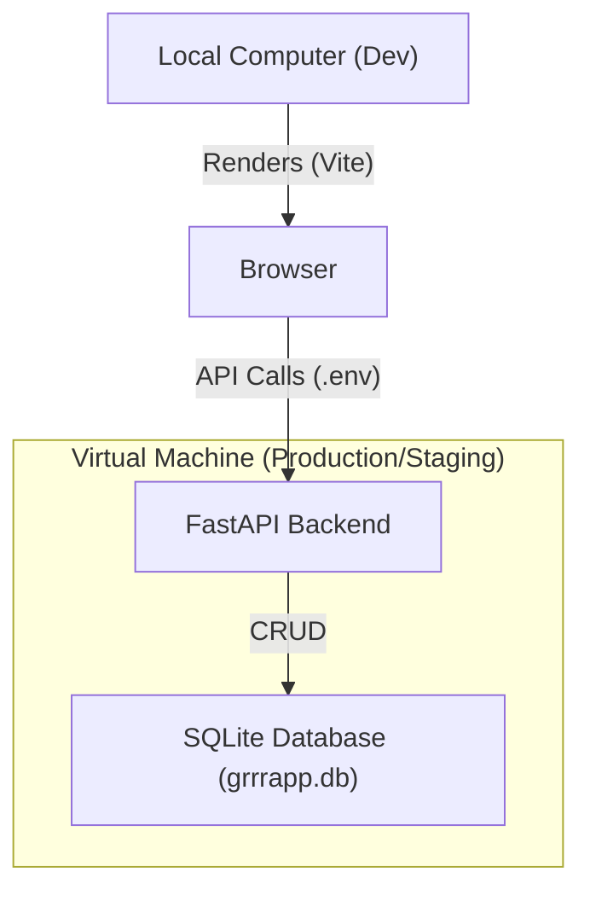

# GrrrAPP VM Deployment Guide

This guide describes how to deploy the backend and database of GrrrAPP to a Virtual Machine (VM).

## Architecture Schema



## Prerequisites

1.  **SSH Access**: You must have the SSH keys in `C:\Users\777\Documents\.conti`.
2.  **VM Setup**: Python 3.8+ installed on the target VM.

## Step-by-Step Deployment

### 1. Prepare Backend Files
You only need the `backend/` folder and the `grrrapp.db` file.

### 2. Move to VM
Use the provided `deploy.ps1` script or manual `scp`:
```powershell
scp -i "C:\Users\777\Documents\.conti\ssh-key-2026-01-26.key" -r backend/ grrrapp.db user@<VM_IP>:/home/user/app/
```

### 3. Install Dependencies on VM
On the VM:
```bash
pip install fastapi uvicorn[standard] sqlmodel
```

### 4. Run Backend on VM
On the VM:
```bash
uvicorn backend.main:app --host 0.0.0.0 --port 8000
```

### 5. Update Local Frontend
On your local machine, update `frontend/.env`:
```env
VITE_API_URL=http://<VM_IP>:8000/api
```

## Using Automation Script
Run `.\deploy.ps1` from the project root. It will automate the file transfer using your `.conti` keys.
